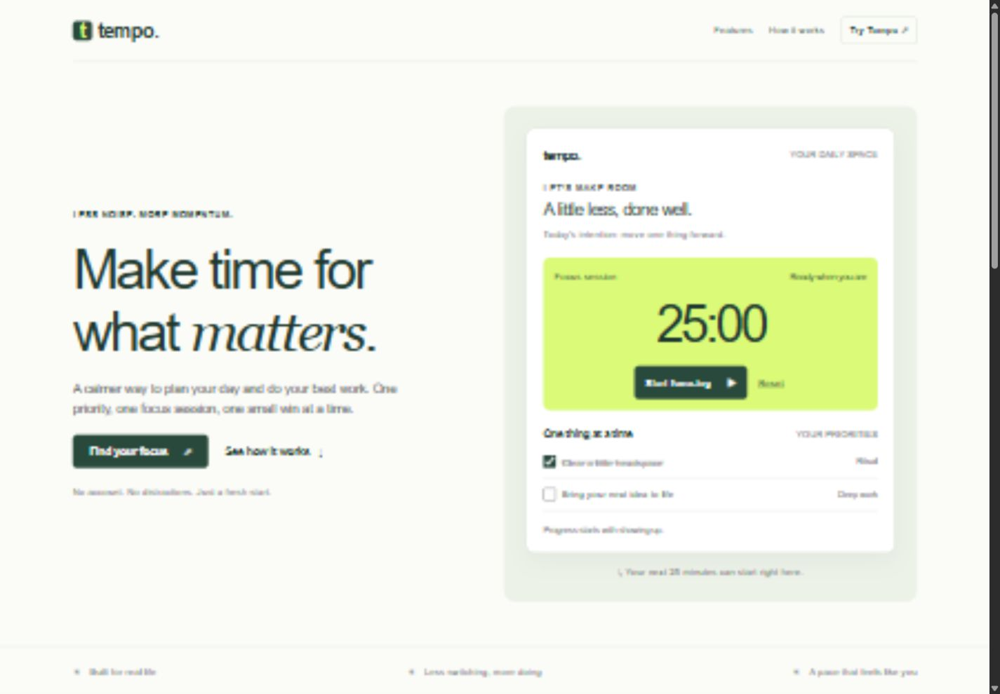
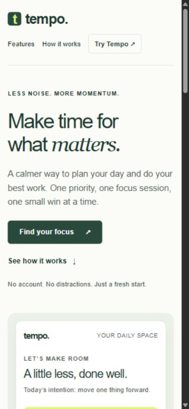

# Assignment 2 — Responsive Landing Page

**Tempo** is a fictional focus-planning app. This original landing page was built for the supplied Assignment 2 brief using plain HTML, CSS, and JavaScript.

## Open the project

1. Extract the entire ZIP or download this repository using **Code → Download ZIP**.
2. Open `index.html` inside the extracted project folder in a modern browser.

No installation, build step, internet connection, external fonts, or API keys are needed. Keep the CSS and JavaScript folders beside `index.html`. You may also serve this folder with any static web server.

## Project contents

```text
assignment-2/
  index.html
  css/style.css
  js/main.js
  screenshots/mobile.png
  screenshots/desktop.png
  README.md
  QA.md
```

## Assignment requirements

- **Several sections:** navigation, hero with product demo, benefit strip, features, how it works, closing call to action, and footer.
- **CSS Grid:** `body` defines header/main/footer rows. `main` defines a centered content column with flexible side tracks; full-width sections span all tracks.
- **Flexbox:** used inside the header, hero, demo, feature cards, benefits, process section, button groups, and footer.
- **Mobile first:** base styles use stacked layouts. `min-width: 40rem` and `min-width: 64rem` queries progressively introduce wider layouts.
- **Design system:** a small forest-green, lime, white, and neutral palette; named spacing tokens based on a 0.25rem unit.
- **Relative units:** rem, percentages, fr, vw, clamp(), flexible tracks, and maximum content widths. Single-pixel borders and visually hidden accessibility content are intentional exceptions.
- **Organized CSS:** tokens, base styles, overall Grid layout, shared components, individual sections, and finally media queries.
- **Responsive behavior:** wrapping navigation and controls, flexible cards, and `min-width: 0` prevent intrinsic content from widening the page. Horizontal overflow is not hidden to mask layout issues.
- **Screenshots:** actual browser captures included for mobile and desktop. See QA.md for viewport sizes and verification results.

## Interaction and accessibility

Navigation and calls to action move to real sections. The local timer starts, pauses, resumes, and resets a 25-minute session. The two example priorities are native interactive checkboxes. Demo state resets on reload; no data is saved or transmitted. The demo is not a full planning service.

The page uses semantic landmarks, a skip link, logical headings, accessible control names, visible keyboard focus, a non-disruptive timer status announcement, and reduced-motion support. The landing page remains readable without JavaScript; only the timer requires it.

## GitHub submission

Submit this repository link alongside the project ZIP:

https://github.com/karamsaid013-svg/assignment-2-responsive-landing-page

## Screenshots

### Desktop



### Mobile



## Credits

Original page copy, styling, and simple favicon created for this project. Uses system fonts and native interface elements, so there are no third-party image or font dependencies. Tempo is fictional; no customer claims or endorsements are presented.
